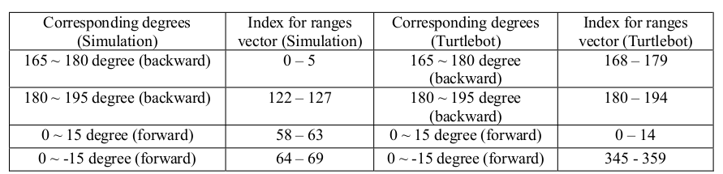

# safe-robot-teleoperation
Implementation of a keyboard based teleoperation system for the turtlebot3 robot to check safety using LiDAR data

# Dependencies
* ROS
* ncurses
```
sudo apt-get install libncurses5 libncurses5-dev
```
## Results


## Implementation
- Safety Check Function: checkSafety(double linear_vel)
From the laser scan data, the ranges vector contains the obstacle distance measurements from -180 degree
to 180 degrees (Turtlebot: 0 – 360 degree). Because the size of the ranges vector is 128 (Turtlebot: 360), I
can assume that each segment represents \
  360 degree / 128 segments = 2.8125 degree / 1 segment (Simulation)
  360 degree / 360 segments = 1 degree / 1segment (Turtlebot)
Thus, for detecting 15 degrees, I need to take 6 segments, which detects 16.875 degrees. Since ranges
vector starts from -180 degree and its index starts from 0, I can get the following results, \

For the forward / backward movement, I checked each corresponding sectors to detect the measurements
less than 0.5 m. This function returns false if it detects less than 0.5m. (In turtlebot, the Lidar scanning
speed is slow, it generate 0.0 often, so I checked the range of “0.0 m < measurement < 0.5 m”.

- Run function: run()
Basically, I published Twist type topic cmd_vel every 10 Hz. Also, if no command is received for 1 sec, I
reset cmd_vel as zero. If it receives any commend, it checks safety from obstacles. If it detects any
obstacles within 0.5 m, it stops linear velocity to avoid a collision, otherwise, it processes user’s command.

## Author

Suhong Kim – [@github](https://github.com/suhongkim) – suhongkim11@gmail.com \
Distributed under the MIT license. See the [LICENSE.md](LICENSE.md) file for details


## Inspiration
This project is a part of the CMPT742 assignments at SFU. 
